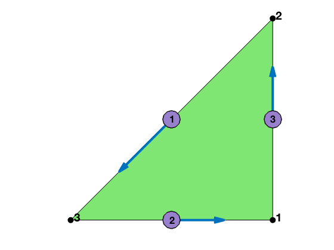
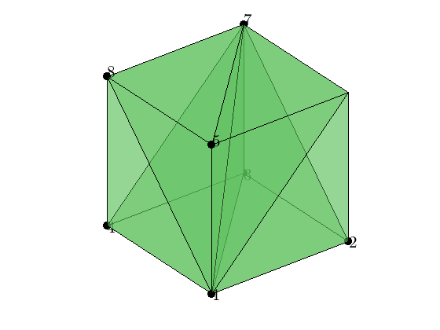
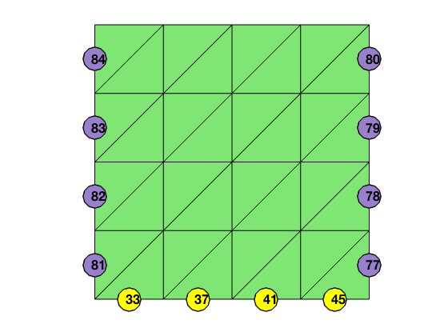
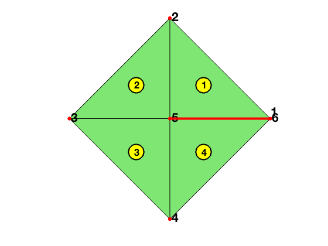
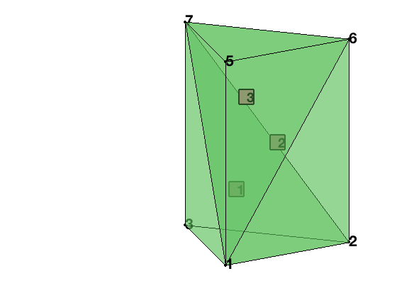

We use `bdFlag(1:NT,1:3)` to record the type of three edges of each
triangle. Similarly in 3-D, we use `bdFlag(1:NT,1:4)` to record the type
of four faces of each tetrahedron. The value is the type of boundary
condition:
- 0: non-boundary, i.e., an interior edge or face.
- 1: first type, i.e., a Dirichlet boundary edge or face. 
- 2: second type, i.e., a Neumann boundary edge or face. 
- 3: third type, i.e., a Robin boundary edge or face.

For a boundary edge/face, the type is 0 means homogenous Neumann boundary condition (zero flux).

The function `setboundary` is to set up the bdFlag matrix for a 2-D
triangulation and `setboundary3` for a 3-D triangulation. Examples

```matlab
bdFlag = setboundary(node,elem,'Dirichlet','abs(x) + abs(y) == 1','Neumann','y==0');
```

```matlab
bdFlag = setboundary3(node,elem,'Dirichlet','(z==1) | (z==-1)');
```


## Local Labeling of Edges and Faces

We label three edges of a triangle such that `bdFlag(t,i)` is the edge
opposite to the i-th vertex. Similarly `bdFlag(t,i)` is the face opposite
to the i-th vertex for a tetrahedron.


```matlab
node = [1,0; 1,1; 0,0];
elem = [1 2 3];
locEdge = [2 3; 3 1; 1 2];
showmesh(node,elem);
findnode(node);
findedge(node,locEdge,'all','vec');
```



​    


The ordering of edges is specified by `locEdge`. If we use `locEdge = [2 3; 1 3; 1 2]`, we get asecond orientation of edges.


## Changing Ordering

If we change the ordering of `elem`, the corresponding local faces are changed. Therefore when we sort the `elem`, we should sort the `bdFlag` simutaneously. For example, `sort(elem,2)` sorts the `elem` only, and leave `bdFlag` unchanged.  Use `sortelem` (2D) or `sortelem3` (3D) to sort `elem` and `bdFlag` at the same time. 


```matlab
[node,elem] = cubemesh([-1,1,-1,1,-1,1],2);
bdFlag = setboundary3(node,elem,'Dirichlet','x==1','Neumann','x~=1');
figure(2); clf;
showmesh3(node,elem);
display(elem); display(bdFlag);
findnode3(node,[1,2,3,4,5,7,8]);
display('change to ascend ordering');
[elem,bdFlag] = sortelem3(elem,bdFlag)
```


    elem =
    
         1     2     3     7
         1     4     3     7
         1     5     6     7
         1     5     8     7
         1     2     6     7
         1     4     8     7


   

    bdFlag =
       6x4 uint8 matrix
    
       1   0   0   2
       2   0   0   2
       2   0   0   2
       2   0   0   2
       1   0   0   2
       2   0   0   2
    
    change to ascend ordering
    
    elem =
    
         1     2     3     7
         1     3     4     7
         1     5     6     7
         1     5     7     8
         1     2     6     7
         1     4     7     8


   

    bdFlag =
       6x4 uint8 matrix
    
       1   0   0   2
       2   0   0   2
       2   0   0   2
       2   0   2   0
       1   0   0   2
       2   0   2   0


​    




## Extract Boundary Edges and Faces

We may extract boundary edges for a 2-D triangulation from `bdFlag` from the following code. If `elem` is sorted counterclockwise, the boundary edges inherits the orientation. See also `findboundary` and `findboundary3`.


```matlab
[node,elem] = squaremesh([0 1 0 1], 0.25);
showmesh(node,elem); hold on;
bdFlag = setboundary(node,elem,'Dirichlet','x == 0 | x ==1','Neumann','y==0');
totalEdge = [elem(:,[2,3]); elem(:,[3,1]); elem(:,[1,2])];
Dirichlet = totalEdge(bdFlag(:) == 1,:);
findedge(node,totalEdge,bdFlag(:) == 1);
Neumann = totalEdge(bdFlag(:) == 2,:); 
findedge(node,totalEdge,bdFlag(:) == 2,'MarkerFaceColor','y');
```


    

Or simply call

```matlab
[bdNode,bdEdge,isBdNode] = findboundary(elem,bdFlag);
```

To find the outward normal direction of the boundary face, we use `gradbasis3` to get `Dlambda(t,:,k)` which is the gradient of $\lambda_k$. The outward normal direction of the kth face can be obtained by `-Dlambda(t,:,k)` which is independent of the ordering and orientation of `elem`.


```matlab
Dlambda = gradbasis3(node,elem);
T = auxstructure3(elem);
elem2face = T.elem2face; 
face = T.face;
NF = size(face,1);
if ~isempty(bdFlag)
    % Find Dirchelt boundary faces and nodes
    isBdFace = false(NF,1);
    isBdFace(elem2face(bdFlag(:,1) == 1,1)) = true;
    isBdFace(elem2face(bdFlag(:,2) == 1,2)) = true;
    isBdFace(elem2face(bdFlag(:,3) == 1,3)) = true; 
    isBdFace(elem2face(bdFlag(:,4) == 1,4)) = true;
    DirichletFace = face(isBdFace,:);
    % Find outwards normal direction of Neumann boundary faces
    bdFaceOutDirec = zeros(NF,3);
    bdFaceOutDirec(elem2face(bdFlag(:,1) == 2,1),:) = -Dlambda(bdFlag(:,1) == 2,:,1);
    bdFaceOutDirec(elem2face(bdFlag(:,2) == 2,2),:) = -Dlambda(bdFlag(:,2) == 2,:,2);
    bdFaceOutDirec(elem2face(bdFlag(:,3) == 2,3),:) = -Dlambda(bdFlag(:,3) == 2,:,3);
    bdFaceOutDirec(elem2face(bdFlag(:,4) == 2,4),:) = -Dlambda(bdFlag(:,4) == 2,:,4);
end
% normalize the boundary face outwards direction
vl = sqrt(dot(bdFaceOutDirec,bdFaceOutDirec,2));
idx = (vl==0);
NeumannFace = face(~idx,:);
bdFaceOutDirec(idx,:) = [];
vl(idx) = [];
bdFaceOutDirec = bdFaceOutDirec./[vl vl vl];
display(DirichletFace);
display(NeumannFace);
display(bdFaceOutDirec);
```


    DirichletFace =
    
      2x3 uint32 matrix
    
       2   3   7
       2   6   7

    NeumannFace =
      10x3 uint32 matrix
    
       1   2   3
       1   2   6
       1   3   4
       1   4   8
       1   5   6
       1   5   8
       3   4   7
       4   7   8
       5   6   7
       5   7   8


  

     bdFaceOutDirec =
        
         0     0    -1
         0    -1     0
         0     0    -1
        -1     0     0
         0    -1     0
        -1     0     0
         0     1     0
         0     1     0
         0     0     1
         0     0     1


## Example: Crack Domain


```matlab
node = [1,0; 0,1; -1,0; 0,-1; 0,0; 1,0];        % nodes
elem = [5,1,2; 5,2,3; 5,3,4; 5,4,6];            % elements
elem = label(node,elem);                        % label the mesh
figure;
showmesh(node,elem);                            % plot mesh
findelem(node,elem);                            % plot element indices
findnode(node,2:6);                             % plot node indices
text(node(6,1),node(6,2)+0.075,int2str(1),'FontSize',16,'FontWeight','bold');
hold on;
plot([node(1,1),node(5,1)], [node(1,2),node(5,2)],'r-', 'LineWidth',3);
bdFlag = setboundary(node,elem,'Dirichlet'); % Dirichlet boundary condition
display(elem)
display(bdFlag)
```


    elem =
    
         5     1     2
         5     2     3
         5     3     4
         5     4     6


​    
​    bdFlag =
​    
​        1    0    1
​        1    0    0
​        1    0    0
​        1    1    0



    


```matlab
bdFlag = setboundary(node,elem,'Dirichlet','abs(x) + abs(y) == 1','Neumann','y==0');
display(bdFlag)
```


    bdFlag =
    
        1    0    2
        1    0    0
        1    0    0
        1    2    0


The red line represents a crack. Although node 1 and node 6 have the same coordinate (1,0), they are different nodes and used in different triangles. An array `u` with `u(1)~=u(6)` represents a discontinous function. Think about a paper cut through the red line. 

## Example: Prism Domain


```matlab
node = [-1,-1,-1; 1,-1,-1; 1,1,-1; -1,1,-1; -1,-1,1; 1,-1,1; 1,1,1; -1,1,1]; 
elem = [1,2,3,7; 1,6,2,7; 1,5,6,7];
elem = label3(node,elem);
figure;
showmesh3(node,elem);
view([-53,8]);
findnode3(node,[1 2 3 5 6 7]);
findelem3(node,elem);
bdFlag = setboundary3(node,elem,'Dirichlet','(z==1) | (z==-1)');
display(elem)
display(bdFlag)
```


    elem =
    
         1     7     2     3
         1     7     6     2
         1     7     5     6


​    
​    bdFlag =
​    
​        0    1    0    0
​        0    0    0    0
​        1    0    0    0



​    

The top and bottom of the prism is set as Dirichlet boundary condition and other faces are zero flux boundary condition. Note that if the i-th face of t is on the boundary but `bdFlag(t,i)=0`, it is equivalent to use homogenous Neumann boundary condition (zero
flux).


## Remark

It would save storage if we record boundary edges or faces only. The current data structure is convenient for the local refinement and coarsening since the boundary can be easily updated along with the change of elements. The matrix `bdFlag` is sparse but a dense matrix is used. We do not save `bdFlag` as a sparse matrix since updating sparse matrices is time-consuming. Instead we set up the type of `bdFlag` to `uint8` to minimize the waste of memory.

